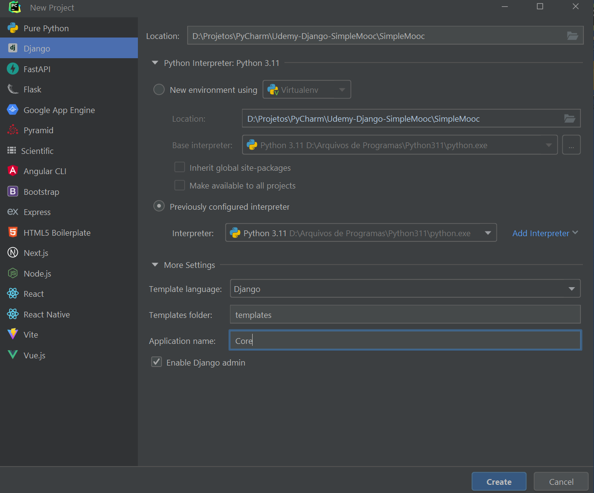

# Django - Simple Mooc

Projeto de criação da aplicação Simple MOOC, que é uma plataforma de ensino a distância, usando Djnago.

## Passos

### Seção 1:
1. Criar projeto no PyCharm ou com ou `django-admin startproject SimpleMooc .`.

2. Em Core > views.py: criar uma função home que recebe request e retorna um HttpResponse.
3. Em templates: criar home.html.
4. Em Core > views.py: alterar a função home para usar o html.
5. Em SimpleMooc > urls.py: adicionar o diretório raiz a função home. (Testar aplicação).

Criar página de contato:
7. Em templates: criar contact.html.
8. Em Core > views.py: criar função contact.
9. Em SimpleMooc > urls.py: relacionar a rota, html e função de contact.

Criar css e adicioná-los nas páginas html 
10. Em Core: criar pasta "static" e "style.css" dentro dela.
   - Para referenciar este arquivo a partir de outros html: 
     - ``
     - `<link rel="stylesheet" href="" />`

Criar template base do qual as outras páginas html herdarão:
11. Em templates: criar base.html
12. Utilizar base.hmtl em outros html:
- Refatore as outras páginas html para extender de base html:  ``
- Coloque o conteúdo de suas body dentro de bloco de conteúdo: `` e ``

(Falta editar as páginas htmls)

## Referências
Udemy - Python 3 na Web com Django (Básico e Intermediário) - Gileno Alves Santa Cruz Filho
